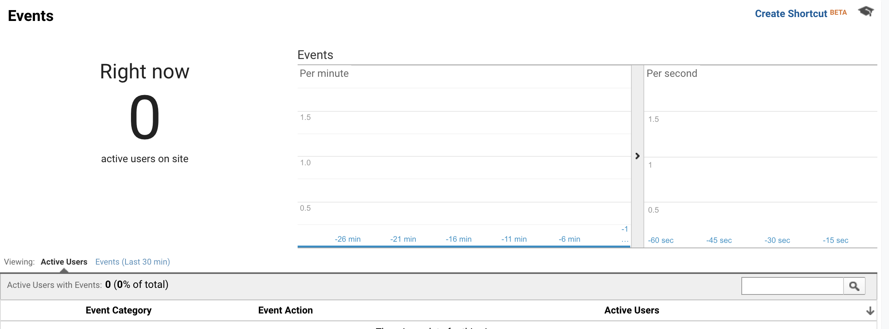

# Lab 10
## Author 
Richard Yang

## Part 1:
 https://cse110-lab10-richardy2971.canny.io/

## Part 2:
 https://richardy2971.github.io/Lab10/
 https://richardy2971.github.io/Lab10/secondSplit
 
## A/B Test:
 For the AB Test I decided to choose a sort of "Dark Mode/Light Mode" The settings are that 50% of the time it will end up with a white background while the other 50% of the time will end up with a dark black background.
## Part 3:
